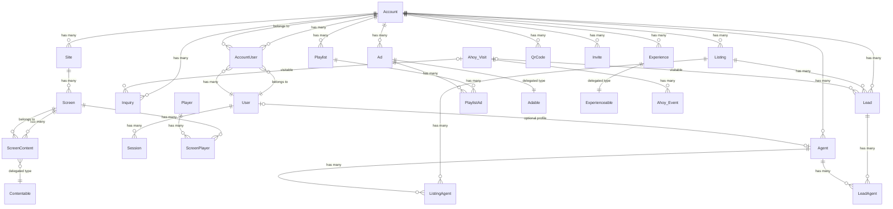

# Domain Model

## Entity relationship diagram

## Model reference

### Tenant and auth

| Model | Table | Key fields | Tenant-scoped | paper_trail |
|-------|-------|------------|:---:|:---:|
| Account | `accounts` | name | — | — |
| User | `users` | email_address, password_digest, first_name, last_name | — | Yes |
| AccountUser | `account_users` | account_id, user_id, role | Yes | Yes |
| Session | `sessions` | user_id, ip_address, user_agent | — | — |
| Invite | `invites` | account_id, email, role, token, accepted_at | Yes | Yes |

`AccountUser.role` values: `owner`, `manager`, `agent`. A user can have multiple roles on the same account (unique index on `[account_id, user_id, role]`).

### Content

| Model | Table | Key fields | Tenant-scoped | paper_trail |
|-------|-------|------------|:---:|:---:|
| Listing | `listings` | address, price, beds, baths, sqft, status, property_type, listing_type, description | Yes | Yes |
| Agent | `agents` | user_id, name, email, phone, bio | Yes | Yes |
| ListingAgent | `listing_agents` | listing_id, agent_id, role, primary_at | — | Yes |
| Ad | `ads` | adable_type, adable_id, headline, body, layout, theme | Yes | Yes |
| Ads::ListingAd | `listing_ads` | listing_id, badge, event_date, event_start_time, event_end_time, original_price, sold_price | — | — |
| Ads::CollectionAd | `collection_ads` | (max 8 member ads via CollectionAdAd) | — | — |
| Ads::AgentAd | `agent_ads` | agent_id | — | — |
| Ads::BrandAd | `brand_ads` | (no extra fields — uses Ad headline/body/image) | — | — |
| Ads::CollectionAdAd | `collection_ad_ads` | collection_ad_id, ad_id | — | — |

### Playback

| Model | Table | Key fields | Tenant-scoped | paper_trail |
|-------|-------|------------|:---:|:---:|
| Site | `sites` | name, address | Yes | Yes |
| Screen | `screens` | site_id, name | Yes | Yes |
| Player | `players` | pairing_code, last_heartbeat_at, device_type, device_name | — | Yes |
| PlayerSession | `player_sessions` | player_id, ip_address, user_agent, last_active_at, revoked_at | — | — |
| ScreenPlayer | `screen_players` | screen_id, player_id, active, paired_by_id | — | Yes |
| ScreenContent | `screen_contents` | screen_id, contentable_type, contentable_id | — | Yes |
| Playlist | `playlists` | name | Yes | Yes |
| PlaylistAd | `playlist_ads` | playlist_id, ad_id, position, duration | — | Yes |
| Experience | `experiences` | name, config, experienceable_type, experienceable_id | Yes | Yes |
| Experiences::ListingExperience | `listing_experiences` | listing_id, agent_id | — | — |

### Engagement

| Model | Table | Key fields | Tenant-scoped | paper_trail |
|-------|-------|------------|:---:|:---:|
| QrCode | `qr_codes` | token, public_id, destination_record (polymorphic), destination_url, active | Yes | — |
| Lead | `leads` | listing_id, ahoy_visit_id, name, email, phone, status, lead_type, message | Yes | Yes |
| LeadAgent | `lead_agents` | lead_id, agent_id | — | Yes |
| Inquiry | `inquiries` | name, email, phone, message, ahoy_visit_id | — | — |

### Analytics

| Model | Table | Key fields | Tenant-scoped | paper_trail |
|-------|-------|------------|:---:|:---:|
| Ahoy::Visit | `ahoy_visits` | visit_token, visitor_token, user_id, account_id, started_at | — | — |
| Ahoy::Event | `ahoy_events` | visit_id, account_id, name, properties (jsonb), time | — | — |
| Rollup | `rollups` | name, interval, time, dimensions (jsonb), value | — | — |

Governed event POROs (`Analytics::Events::*`) validate and fire Ahoy events. They also provide query scopes via `Base.events` and `Base.where_properties`. See `docs/dev/event-catalog.md`.

## Join models

| Join model | Connects | Extra data |
|-----------|----------|-----------|
| AccountUser | User ↔ Account | role |
| ListingAgent | Listing ↔ Agent | role, primary_at |
| LeadAgent | Lead ↔ Agent | created_at (assignment history) |
| PlaylistAd | Playlist ↔ Ad | position, duration |
| ScreenPlayer | Screen ↔ Player | active, paired_by, paired_at, unpaired_at |
| ScreenContent | Screen ↔ Contentable | delegated type |
| CollectionAdAd | CollectionAd ↔ Ad | — |

## Delegated types

### Ad → Adable

`Ad` uses `delegated_type :adable` with 4 variants:

| Type | Class | Table | Layouts |
|------|-------|-------|---------|
| Listing ad | `Ads::ListingAd` | `listing_ads` | hero, split, minimal, stat_grid |
| Collection ad | `Ads::CollectionAd` | `collection_ads` | grid |
| Agent ad | `Ads::AgentAd` | `agent_ads` | profile, split |
| Brand ad | `Ads::BrandAd` | `brand_ads` | hero, minimal |

### ScreenContent → Contentable

`ScreenContent` uses `delegated_type :contentable` with 2 variants:

| Type | Class | Description |
|------|-------|-------------|
| Playlist | `Playlist` | Passive ad slideshow |
| Experience | `Experience` | Interactive kiosk |

### Experience → Experienceable

`Experience` uses `delegated_type :experienceable`:

| Type | Class | Description |
|------|-------|-------------|
| Listing experience | `Experiences::ListingExperience` | Single listing presentation with photo gallery, agent card, QR handoff |
