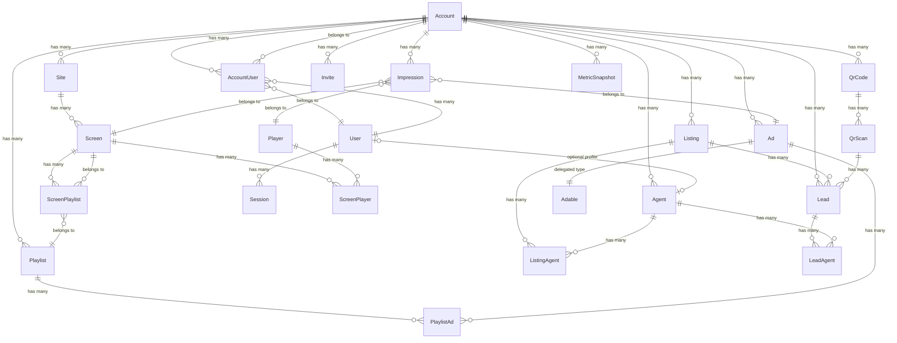

# Domain Model

## Entity relationship diagram

## Model reference

### Tenant and auth

| Model | Table | Key fields | Tenant-scoped | paper_trail |
|-------|-------|------------|:---:|:---:|
| Account | `accounts` | name | — | — |
| User | `users` | email_address, password_digest | — | Yes |
| AccountUser | `account_users` | account_id, user_id, role | Yes | Yes |
| Session | `sessions` | user_id, ip_address, user_agent | — | — |
| Invite | `invites` | account_id, email, role, token, accepted_at | Yes | Yes |

`AccountUser.role` values: `owner`, `manager`, `agent`. A user can have multiple roles on the same account (unique index on `[account_id, user_id, role]`).

### Content

| Model | Table | Key fields | Tenant-scoped | paper_trail |
|-------|-------|------------|:---:|:---:|
| Listing | `listings` | account_id, address, price, bedrooms, bathrooms, sqft, status | Yes | Yes |
| Agent | `agents` | account_id, user_id, name, email, phone, title | Yes | Yes |
| ListingAgent | `listing_agents` | listing_id, agent_id, role, primary_at | Yes | Yes |
| Ad | `ads` | account_id, adable_type, adable_id, layout, theme, title | Yes | Yes |
| Ads::ListingAd | `listing_ads` | listing_id, badge, event_date, event_time | — | — |
| Ads::CollectionAd | `collection_ads` | (max 8 member ads) | — | — |
| Ads::AgentAd | `agent_ads` | agent_id | — | — |
| Ads::BrandAd | `brand_ads` | headline, body | — | — |
| Ads::CollectionAdAd | `collection_ad_ads` | collection_ad_id, ad_id | — | — |

### Playback

| Model | Table | Key fields | Tenant-scoped | paper_trail |
|-------|-------|------------|:---:|:---:|
| Site | `sites` | account_id, name, address | Yes | Yes |
| Screen | `screens` | site_id, name | Yes | Yes |
| Player | `players` | token, pairing_code, last_heartbeat_at | — | Yes |
| ScreenPlayer | `screen_players` | screen_id, player_id, active, paired_by_id | — | Yes |
| ScreenPlaylist | `screen_playlists` | screen_id, playlist_id | — | Yes |
| Playlist | `playlists` | account_id, name | Yes | Yes |
| PlaylistAd | `playlist_ads` | playlist_id, ad_id, position, duration | — | Yes |

### Engagement

| Model | Table | Key fields | Tenant-scoped | paper_trail |
|-------|-------|------------|:---:|:---:|
| QrCode | `qr_codes` | account_id, token, destination_record (polymorphic) | Yes | — |
| QrScan | `qr_scans` | qr_code_id, account_id, ad_id, screen_id, ip_address | Yes | — |
| Lead | `leads` | account_id, listing_id, qr_scan_id, name, email, phone, status, lead_type | Yes | Yes |
| LeadAgent | `lead_agents` | lead_id, agent_id | — | Yes |

### Analytics

| Model | Table | Key fields | Tenant-scoped | paper_trail |
|-------|-------|------------|:---:|:---:|
| Impression | `impressions` | ad_id, screen_id, player_id, site_id, account_id, playlist_id, position, duration | Yes | — |
| MetricSnapshot | `metric_snapshots` | account_id, metric_name, value, starts_at, ends_at | Yes | — |

## Join models

| Join model | Connects | Extra data |
|-----------|----------|-----------|
| AccountUser | User ↔ Account | role |
| ListingAgent | Listing ↔ Agent | role, primary_at |
| LeadAgent | Lead ↔ Agent | created_at (assignment history) |
| PlaylistAd | Playlist ↔ Ad | position, duration |
| ScreenPlayer | Screen ↔ Player | active, paired_by, paired_at, unpaired_at |
| ScreenPlaylist | Screen ↔ Playlist | — |
| CollectionAdAd | CollectionAd ↔ Ad | — |

## Delegated types

`Ad` uses `delegated_type :adable` with 4 variants:

| Type | Class | Table | Layouts |
|------|-------|-------|---------|
| Listing ad | `Ads::ListingAd` | `listing_ads` | hero, split, minimal, stat_grid |
| Collection ad | `Ads::CollectionAd` | `collection_ads` | grid |
| Agent ad | `Ads::AgentAd` | `agent_ads` | profile, split |
| Brand ad | `Ads::BrandAd` | `brand_ads` | hero, minimal |

Each variant has its own validations, associations, and content partial. The `Ad` parent record holds the shared fields (layout, theme, image, title) and delegates type-specific behavior to the adable.
